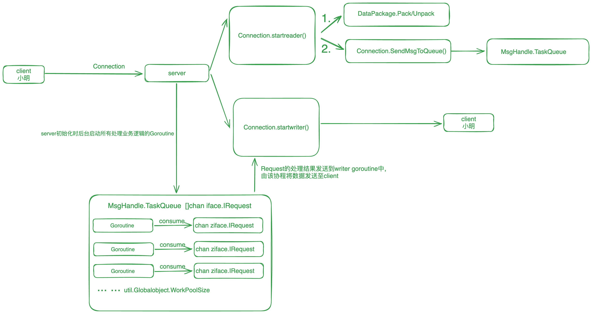

# infra-TCPServer
An Web Server based TCP protocol

### CodeView
- conf dir stores configuration related
- test dir strors test related
- ziface dir stores interface related
- znet dir stores detail implemention 

### WorkerPool and Async
WorkerPool mode
- Hash：对connectionid % workPoolSize，会出现多个connection共用一个worker goroutine的情况
- Bind：对每个connection绑定一个专属的worker goroutine

Async module
Refer Async goroutine to handle time-expensive tasks and return result of that task

### RouterSlice && Group
