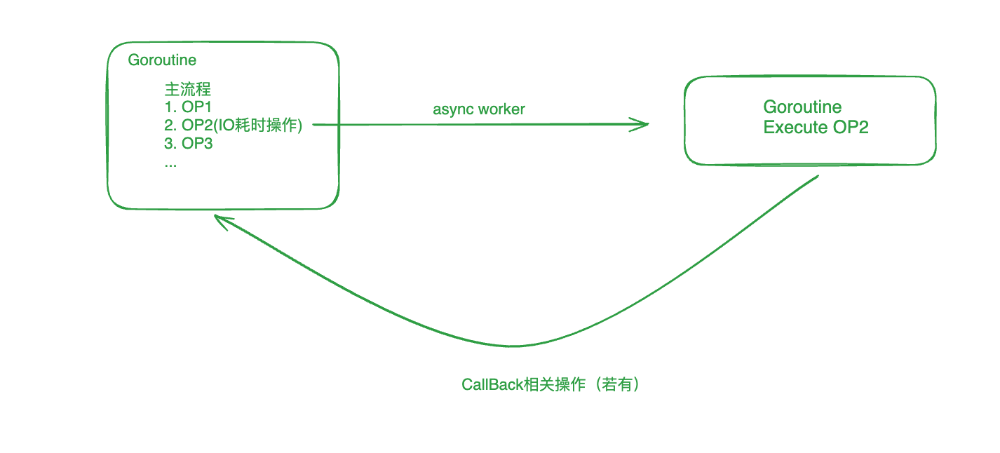

### Async module
1. Provide asynchronous gorourine to handel block request, such as IO request...
2. Provide callback function when asynchronous function has been done
- 将需要耗时的操作（如数据库IO、文件IO等）， 直接将这部分业务逻辑放到专门的后台线程/Goroutine中去执行。我们称这种任务处理的方式为异步处理
- 异步处理完成后，如果主流程需要使用到处理后的结果/还有剩余的业务逻辑需要执行，则将剩余任务以`callback()`的方式将回调函数发送到原来的线程中去执行

